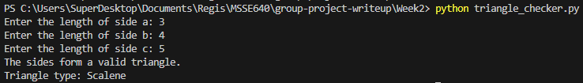
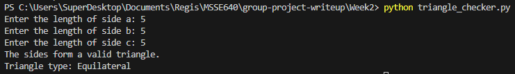
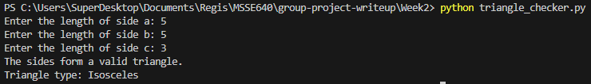
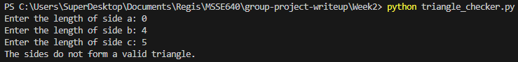
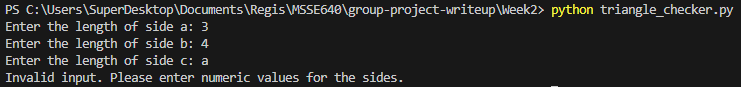
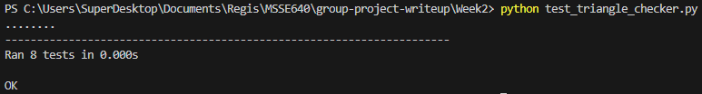

# Triangle Checker Exercise Writeup

## Introduction

This program implements a triangle checker that determines if three given side lengths can form a valid triangle and classifies the triangle type (Equilateral, Isosceles, or Scalene). The program consists of two main functions: `is_valid_triangle` for validation and `triangle_type` for classification. Error handling is managed in the main function using a try-except block to catch invalid numeric inputs, prompting the user to enter valid numbers. Unit tests were chosen to comprehensively cover all possible scenarios, including valid and invalid triangles, different types, and edge cases like zero-length sides.

## Details of the Program

The IDE used for development was Visual Studio Code. Data is input into the program in two ways: through user prompts in the interactive main function, where the user is asked to enter the lengths of the three sides, and through unit tests that directly call the functions with predefined values. No file reading or writing is implemented; all input is handled via console prompts or test cases. Results are displayed on the console for the interactive mode.

## Table with Example Test Data

| Side A | Side B | Side C | Valid? | Type          |
|--------|--------|--------|--------|---------------|
| 3      | 4      | 5      | Yes    | Scalene       |
| 5      | 5      | 5      | Yes    | Equilateral   |
| 5      | 5      | 3      | Yes    | Isosceles     |
| 1      | 2      | 10     | No     | N/A           |
| 0      | 4      | 5      | No     | N/A           |
| 3      | 4      | a      | No     | N/A           |

## Unit Tests

The unit tests are implemented in `test_triangle_checker.py` using Python's `unittest` framework. They include tests for valid triangles, invalid triangles (including zero-length sides and triangle inequality violations), and all three triangle types (Equilateral, Isosceles, Scalene). Specific tests cover permutations of side orders for Scalene triangles to ensure robustness. These tests were chosen to verify correctness across all logical paths and edge cases, ensuring the functions handle inputs properly without assumptions about order.

## Bugs Encountered During Testing

No significant bugs were encountered during testing. The initial implementation passed all unit tests without issues. Minor adjustments were made to ensure proper handling of floating-point inputs in the main function.

## Problems

No major problems were encountered during development. The program was straightforward to implement, and the unit tests ran successfully from the start. One minor issue was ensuring that the __pycache__ directory was not unnecessarily committed, but this was resolved by noting it in the commit process.

## Screen Shots

#### 1. **Successful Program Run**: 
A screenshot showing the console output when running `triangle_checker.py` interactively. First  with inputs 3, 4, 5, displaying "The sides form a valid triangle. Triangle type: Scalene". Second,  with inputs 5, 5, 5, displaying "The sides form a valid triangle. Triangle type: Equilateral". Third,  with inputs 5, 5, 3, displaying "The sides form a valid triangle. Triangle type: Isosceles".
#### Successful Program Run 1

#### Successful Program Run 2

#### Successful Program Run 3

#### 2. **Unsuccessful Program Run**: 
A screenshot showing the console output when running `triangle_checker.py` interactively. First  with inputs 0, 4, 5, displaying "The sides do not form a valid triangle". Second,  with inputs 3, 4, a, displaying "Invalid input. Please enter numeric values for the sides". 
#### Unsuccessful Program Run 1

#### Unsuccessful Program Run 2

#### 3. **Unit Test Run**: 
A screenshot of the terminal running `python -m unittest test_triangle_checker.py`, showing all tests passing (e.g., "Ran 8 tests in 0.001s OK").
#### Unit Test Successful Program Run

