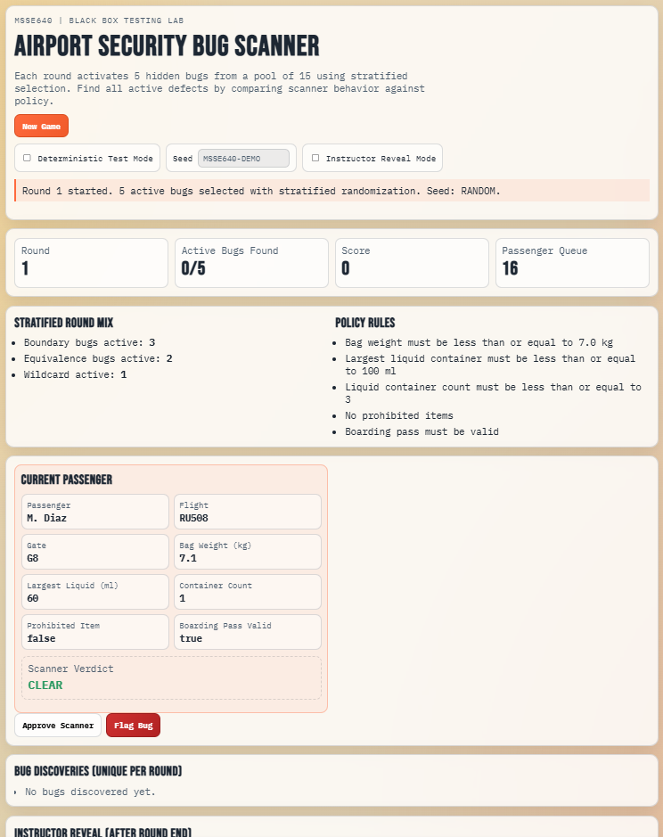
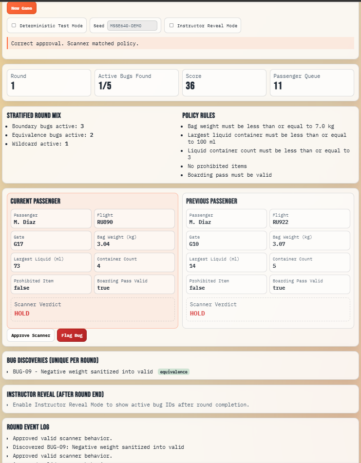
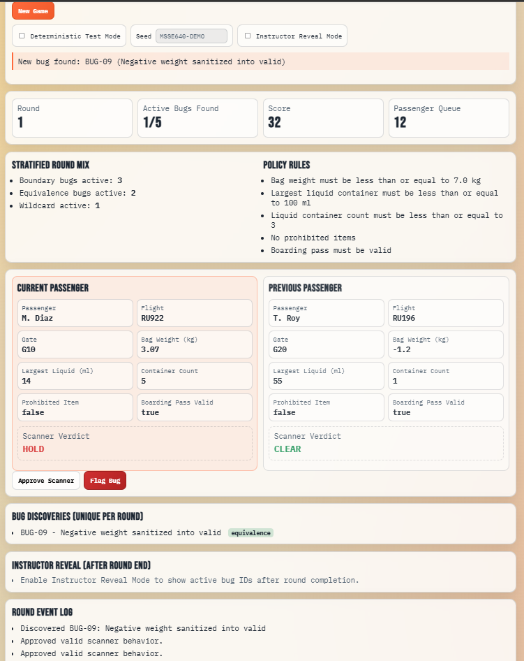
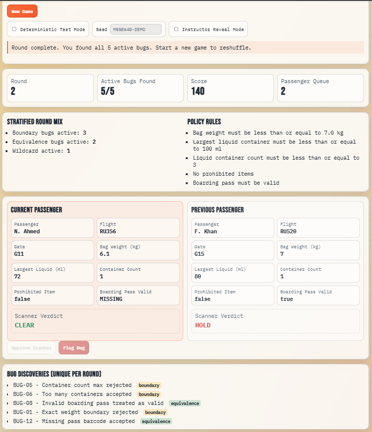

# Week 3 - Vibe Coding Mini Project Writeup

## Introduction
This project uses an interactive Airport Security Bug Scanner game to demonstrate black-box test case design with Equivalence Class Partitioning (ECP) and Boundary Value Analysis (BVA).

### Methodology
- Equivalence classes divide passenger inputs into valid and invalid groups (for example, valid pass vs invalid pass, prohibited item vs no prohibited item).
- Boundary values target exact limits and just-over limits for screening policy fields.
  - Bag weight boundary around 7.0 kg
  - Largest liquid boundary around 100 ml
  - Container count boundary around 3
- The app includes a 15-bug catalog and activates 5 unique bugs per round with stratified randomization.
  - At least 2 boundary bugs
  - At least 2 equivalence bugs
  - 1 wildcard bug

### When This Test Case Approach Should Be Used
- Use ECP when an input field has clear valid and invalid categories and you need broad coverage with fewer tests.
- Use BVA when defects are likely around numeric cutoffs, limits, and exact threshold conditions.
- Use the combined approach when business rules include both class rules and numeric thresholds.

### Limitations
- ECP can miss defects caused by interactions across multiple fields if classes are tested in isolation.
- BVA focuses near limits and can miss logic defects in non-boundary mid-range inputs.
- A game simulation is useful for teaching, but it does not replace production integration tests with real systems.

## Vibe Coding Assignment

### Sample App
- Language: HTML/CSS/JavaScript
- App files:
  - airport-security-game/index.html
  - airport-security-game/styles.css
  - airport-security-game/app.js
- Current gameplay UI behavior:
  - Two side-by-side passenger panels: Current Passenger and Previous Passenger
  - Action-only flow with Approve Scanner and Flag Bug for automated progression
  - Automatic passenger progression 500ms after each decision

### Sunny Day Scenarios
Sunny Day scenarios represent expected valid behavior where the scanner and policy agree.

| Scenario | Input Example | Expected Policy Verdict | Scanner Verdict | Why It Is Sunny Day |
|---|---|---|---|---|
| S1: Valid passenger | weight=6.4, liquid=80, containers=2, prohibited=false, passValid=true | CLEAR | CLEAR | Valid equivalence class and inside all boundaries |
| S2: Exact boundary accepted | weight=7.0, liquid=100, containers=3, prohibited=false, passValid=true | CLEAR | CLEAR (non-bug case) | Exact boundary is valid and should pass |

### Rainy Day Scenarios
Rainy Day scenarios represent defect-prone or invalid behavior and include buggy outcomes.

| Scenario | Input Example | Expected Policy Verdict | Scanner Verdict | Defect Type |
|---|---|---|---|---|
| R1: Just-over weight accepted | weight=7.1, liquid=60, containers=1, prohibited=false, passValid=true | HOLD | CLEAR | Boundary bug (just over max weight) |
| R2: Invalid class accepted | weight=5.9, liquid=60, containers=1, prohibited=false, passValid=false | HOLD | CLEAR | Equivalence bug (invalid pass class) |
| R3: Malformed input accepted | weight="6,5", liquid=70, containers=1, prohibited=false, passValid=true | HOLD | CLEAR | Equivalence bug (malformed numeric input) |

### Code Snippets
Snippet 1 shows stratified bug selection (2 boundary + 2 equivalence + 1 wildcard):

```javascript
function chooseActiveBugsStratified() {
  const boundary = BUG_CATALOG.filter((bug) => bug.category === "boundary");
  const equivalence = BUG_CATALOG.filter((bug) => bug.category === "equivalence");

  const pickBoundary = sampleUnique(boundary, 2);
  const pickEquivalence = sampleUnique(equivalence, 2);
  const chosen = [...pickBoundary, ...pickEquivalence];

  const remaining = BUG_CATALOG.filter((bug) => !chosen.some((selected) => selected.id === bug.id));
  const wildcard = sampleUnique(remaining, 1);

  return shuffle([...chosen, ...wildcard]);
}
```

Snippet 2 shows unique bug counting logic (no duplicate increment):

```javascript
if (flagged) {
  if (hasBug) {
    if (!state.discoveredBugIds.has(scenario.bugId)) {
      state.discoveredBugIds.add(scenario.bugId);
      state.score += 20;
    } else {
      state.score += 1;
    }
  }
}
```

Snippet 3 shows automatic progression after each decision (500ms delay):

```javascript
if (endRoundIfNeeded()) {
  return;
}

setTimeout(() => {
  loadNextScenario();
}, 500);
```

Snippet 4 shows Current/Previous passenger tracking:

```javascript
if (state.currentScenario) {
  state.previousScenario = state.currentScenario;
}

state.currentScenario = state.queue.shift() || null;
```

### Screenshots

#### 1. Main gameplay screen 

#### 2. Example Sunny Day decision (correct approval)

#### 3. Example Rainy Day decision (correct bug flag) 

#### 4. End-of-round screen showing discovered bugs and event log


## Conclusion
### Problems I Had
- Prompt wording sometimes generated UI behavior that was close, but not exactly aligned to the test-case rules.
- I had to refine prompts multiple times to enforce specific requirements like stratified bug selection and unique bug counting.
- AI-generated structure was useful, but I still needed manual verification to ensure the logic matched ECP and BVA goals.

### What I Learned About AI Tools
- AI tools are effective for fast prototyping and generating a first implementation of game logic.
- Clear constraints in prompts produce better technical outcomes than open-ended requests.
- Human review is still required to validate correctness, especially for testing logic and edge-case behavior.
- AI output is strongest when paired with explicit acceptance criteria, scenario-based checks, and iterative refinement.
