# Week 4: Performance Testing and JMeter Deliverable

## Part 1: Research on Performance Testing and JMeter

### 1. Types of Performance Tests

#### Load Test
A load test measures how an application behaves under expected or steadily increasing user traffic. The goal is to verify stable performance at normal and near-normal usage levels.

Common indicators to watch:
- Average response time
- Throughput (requests per second)
- Error rate

Expected pattern:
- Threads rise gradually over time.
- Response time usually increases slowly as concurrency grows.
- Errors should remain low if capacity is sufficient.

Graph (Time on X axis, Number of Threads on Y axis):

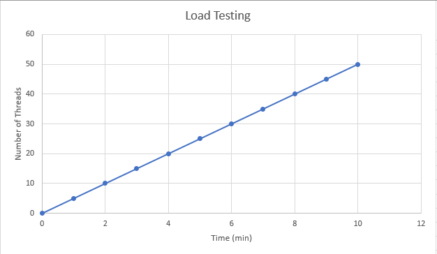

#### Endurance Test
An endurance test (also called soak testing) checks whether the system remains stable over a long duration under sustained load. The goal is to detect issues that appear over time, such as memory leaks, resource exhaustion, or connection pool problems.

Common indicators to watch:
- Performance drift over time
- Memory growth
- Error-rate stability

Expected pattern:
- Threads are held at a mostly steady level for an extended period.
- Response times should remain consistent.
- Error rates should not gradually increase.

Graph (Time on X axis, Number of Threads on Y axis):

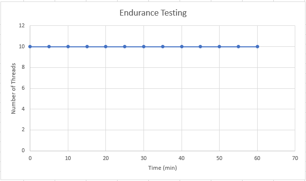

#### Stress/Spike Test
Stress and spike tests intentionally push the system beyond expected limits to observe failure behavior and recovery. A spike test specifically introduces sudden jumps in concurrency.

Common indicators to watch:
- Failure threshold
- Timeouts and non-200 responses
- Recovery behavior after spike reduction

Expected pattern:
- Threads rise sharply in a short time window.
- Response time and errors can increase quickly during peak.
- After load drops, system should recover to stable behavior.

Graph (Time on X axis, Number of Threads on Y axis):

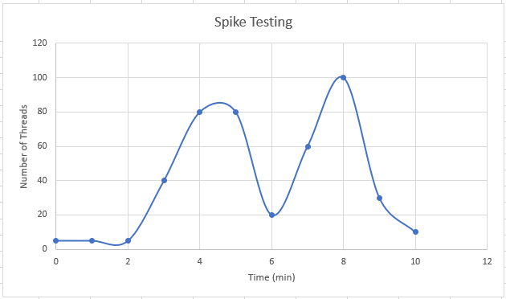

### 2. JMeter Components

#### Thread Groups
A Thread Group defines virtual users, ramp-up timing, and loop behavior. It controls how much concurrent traffic JMeter generates and for how long.

How used in this assignment:
- Endurance Thread Group for sustained requests
- Load (or Stress/Spike) Thread Group for the second scenario

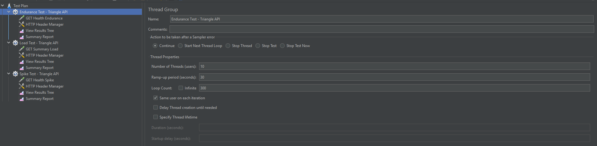

#### HTTP Request Sampler
An HTTP Request Sampler sends HTTP calls (GET, POST, PUT, DELETE) to a target API endpoint. It is the element that actually generates traffic to the application.

How used in this assignment:
- GET `/health` for endurance validation
- GET `/triangles/summary` for load testing

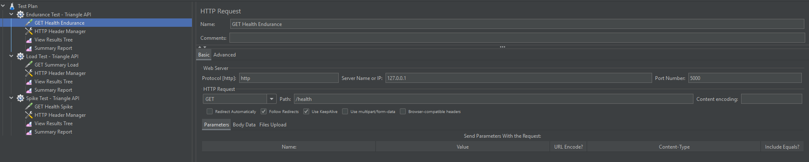

#### Config Elements
Config Elements supply shared settings that samplers use, such as defaults, variables, or headers. A common example is HTTP Header Manager.

How used in this assignment:
- HTTP Header Manager sets:
   - `Accept: application/json`
   - `User-Agent: JMeter-...`

Why Config Elements are important in a Test Plan:
- Consistency across requests: placing shared settings in one Config Element ensures all related samplers send the same expected request metadata.
- Reduced setup mistakes: without Config Elements, each sampler must be configured manually, which increases the chance of missing or conflicting headers.
- Easier maintenance: if a header value or default setting changes, updating one Config Element is faster and less error-prone than editing many samplers.
- Better readability: test plans are easier to understand when common behavior is centralized and samplers focus only on endpoint-specific details.
- More realistic traffic: APIs often require specific headers, authentication context, or content expectations; Config Elements help simulate real client behavior more accurately.
- Stronger scalability of the plan: as tests grow to include many endpoints, shared config avoids duplication and keeps the plan manageable.

In this project specifically, using HTTP Header Manager at the Thread Group level ensures every request in that group consistently requests JSON responses and carries a clear test user-agent identity.

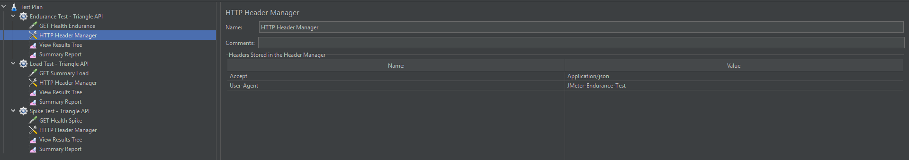

#### Listeners
Listeners display and store results from test execution. They are used to inspect requests, responses, and summary metrics.

How used in this assignment:
- View Results Tree for request/response inspection
- Summary Report for aggregate metrics like average response time and throughput

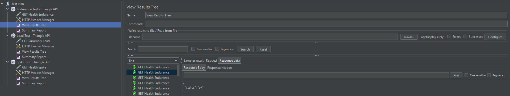
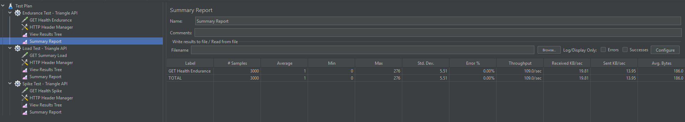

### 3. Application Performance Index (Apdex)
Application Performance Index (Apdex) is a standard metric used to summarize user satisfaction based on response times.

Apdex classifies responses into three categories:
- Satisfied: response time is less than or equal to target threshold `T`
- Tolerating: response time is greater than `T` but less than or equal to `4T`
- Frustrated: response time is greater than `4T` or request fails

Formula:

`Apdex = (Satisfied Count + 0.5 * Tolerating Count) / Total Samples`

Interpretation:
- `1.0` is best (all satisfied)
- `0.85+` is typically considered good
- Lower scores indicate more user frustration and degraded perceived performance

Why it is useful:
- Converts raw latency data into a single user-focused KPI
- Helps compare performance across builds and test runs
- Easier to communicate to non-technical stakeholders than raw percentiles alone

---

## Part 2: JMeter Video Demo or Test Document with Screenshots

## Purpose
This document is the implementation guide and evidence template for Part 2. It covers:
- The required Endurance test flow in JMeter
- Second-test option Load test
- Both submission modes (video demo and screenshot document)

## Test Target and Preconditions
### API Target
Use the local Triangle API from Week 3:
- Base URL: `http://127.0.0.1:5000`
- Recommended GET endpoints:
  - `/health`
  - `/triangles/summary`
  - `/triangles?type=Scalene`

### Preconditions
1. Start the API from `group-project-writeup/Week3`:
   - `pip install -r requirements.txt`
   - `python triangle_api.py`
2. Confirm service is up:
   - `GET http://127.0.0.1:5000/health`
3. Launch JMeter.

## Required Test 1: Endurance Test
### A. Create Thread Group
1. In JMeter: Test Plan > Add > Threads (Users) > Thread Group.
2. Name it: `Endurance Test - Triangle API`.
3. Suggested settings for local machine:
   - Number of Threads (users): `10`
   - Ramp-up period (seconds): `30`
   - Loop Count: `300`

### B. Create HTTP Request Sampler
1. Right-click Thread Group > Add > Sampler > HTTP Request.
2. Name it: `GET Health Endurance`.
3. Configure:
   - Protocol: `http`
   - Server Name or IP: `127.0.0.1`
   - Port Number: `5000`
   - Method: `GET`
   - Path: `/health`

### C. Add Config Element: HTTP Header Manager
1. Right-click Thread Group > Add > Config Element > HTTP Header Manager.
2. Add header values:
   - `Accept: application/json`
   - `User-Agent: JMeter-Endurance-Test`

### D. Add Listener: View Results Tree
1. Right-click Thread Group > Add > Listener > View Results Tree.
2. (Recommended additional listener) Add Summary Report:
   - Right-click Thread Group > Add > Listener > Summary Report.

### E. Run and Observe
1. Click Start.
2. Confirm successful responses in View Results Tree.
3. Confirm low/zero error rate in Summary Report.

## Required Test 2 Candidate: Load Test
Use this if you want a gradual performance profile.

### A. Create Thread Group
1. Add another Thread Group.
2. Name it: `Load Test - Triangle API`.
3. Suggested settings:
   - Number of Threads (users): `50`
   - Ramp-up period (seconds): `120`
   - Loop Count: `50`

### B. Create HTTP Request Sampler
1. Add HTTP Request sampler under this Thread Group.
2. Name it: `GET Summary Load`.
3. Configure:
   - Protocol: `http`
   - Server Name or IP: `127.0.0.1`
   - Port Number: `5000`
   - Method: `GET`
   - Path: `/triangles/summary`

### C. Add HTTP Header Manager
1. Add HTTP Header Manager under this Thread Group.
2. Add headers:
   - `Accept: application/json`
   - `User-Agent: JMeter-Load-Test`

### D. Add Listener: View Results Tree
1. Add View Results Tree under this Thread Group.
2. (Recommended) Add Summary Report or Aggregate Report.

### E. Run and Observe
1. Start test.
2. Watch response time and throughput changes as concurrency ramps up.

## Submission Mode A: Video Demo Workflow
[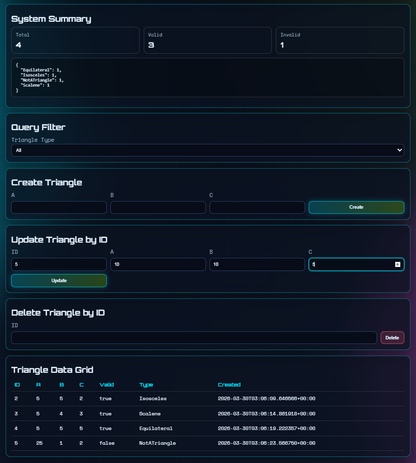](https://www.youtube.com/watch?v=06vKyuqymmo)

## Submission Mode B: Test Document with Screenshots
### Endurance Images
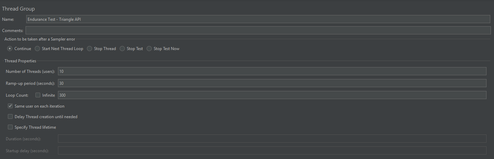
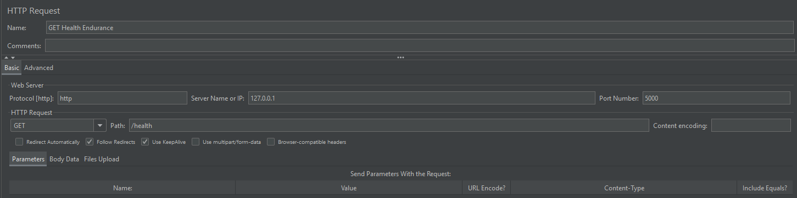
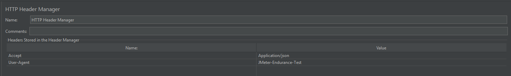
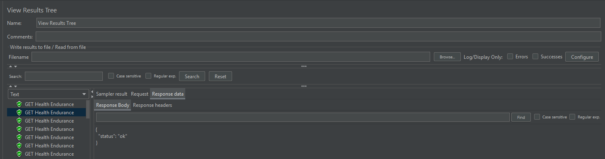

### Load Images 
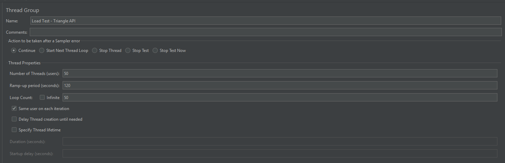
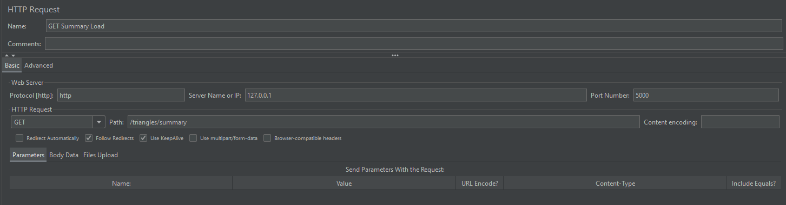
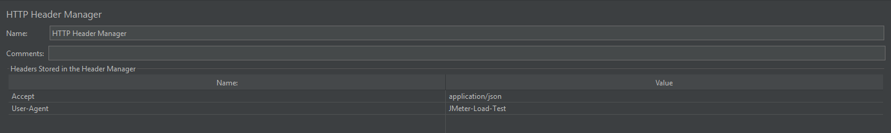
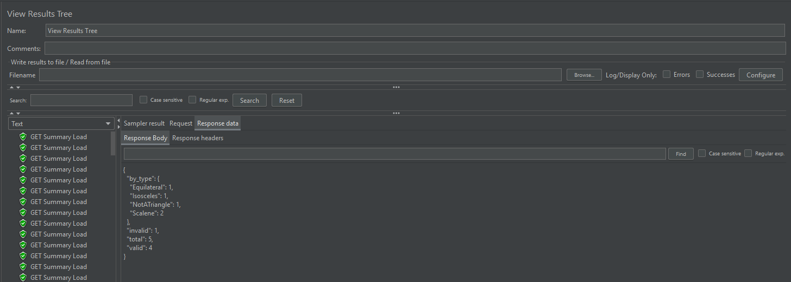
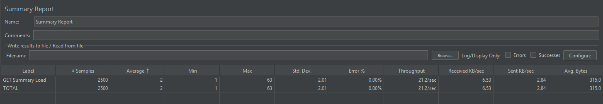

## Results Template
### Endurance Test Results
- Avg response time: 1 ms
- Throughput: 109 req/sec
- Error %: 0%

### Load Test Results (if selected)
- Avg response time: 2 ms
- Throughput: 21.2 req/sec
- Error %: 0%

## Extra Credit
### Short Command List
- `top`: Live CPU and memory usage by process.
- `htop`: Interactive process monitor with easier navigation.
- `vmstat 1`: CPU, memory, swap, and I/O summary every second.
- `iostat -xz 1`: Disk I/O utilization and wait metrics.
- `sar -u 1 10`: CPU utilization over sampled intervals.
- `free -h`: System memory and swap usage.
- `mpstat -P ALL 1`: Per-core CPU utilization.
- `pidstat 1`: Per-process CPU, memory, and I/O trends.
- `ss -s`: TCP/UDP socket summary.
- `dstat -tcmnd`: Combined CPU, memory, network, disk metrics.
- `uptime`: Load average and system uptime.
- `journalctl -p err -n 100`: Recent error-level system logs.

### Detailed Command List
#### 1. CPU and Process Pressure
1. `top`
   - Use when: You need immediate visibility into high CPU or memory consumers.
   - Read: `%CPU`, `%MEM`, load averages, and process state columns.
2. `htop`
   - Use when: You want easier sorting/filtering than top.
   - Read: Per-core utilization bars and per-process resource usage.
3. `mpstat -P ALL 1`
   - Use when: Diagnosing single-core bottlenecks hidden by average CPU.
   - Read: `%usr`, `%sys`, `%iowait`, and `%idle` per core.
4. `pidstat 1`
   - Use when: Tracking which process spikes during tests.
   - Read: Process-level CPU/memory/I/O trends per second.

#### 2. Memory and Swap Health
1. `free -h`
   - Use when: Quick memory pressure check.
   - Read: `available` memory and swap usage.
2. `vmstat 1`
   - Use when: You need memory + CPU + I/O in one view.
   - Read: `si/so` (swap in/out), `r` (run queue), `wa` (I/O wait).

#### 3. Disk and I/O Performance
1. `iostat -xz 1`
   - Use when: Storage may be limiting response times.
   - Read: `%util`, `await`, `svctm`, read/write throughput.
2. `pidstat -d 1`
   - Use when: Finding which process is causing heavy disk activity.
   - Read: Per-process read/write rates and I/O delay.

#### 4. Network and Connection State
1. `ss -s`
   - Use when: Quick socket health summary.
   - Read: Established sockets, TCP states, connection buildup.
2. `ss -tuna`
   - Use when: Detailed active/listening socket diagnostics.
   - Read: Backlog, state distribution, and unexpected open ports.

#### 5. Historical and Time-Series Monitoring
1. `sar -u 1 10`
   - Use when: Collecting sampled CPU history during a test window.
   - Read: Trend of `%idle` and `%iowait` over 10 intervals.
2. `dstat -tcmnd`
   - Use when: You want one-line correlated metrics over time.
   - Read: Timestamped CPU, memory, network, and disk values together.

#### 6. System-Level Context and Errors
1. `uptime`
   - Use when: Fast workload context check.
   - Read: 1, 5, and 15 minute load averages relative to CPU cores.
2. `journalctl -p err -n 100`
   - Use when: Correlating failures/timeouts with system errors.
   - Read: Recent kernel/service errors around the performance test period.

## References
- Apache JMeter User Manual - Test Plan and Thread Groups:
  - https://jmeter.apache.org/usermanual/test_plan.html#thread_group
- Apache JMeter Component Reference (Thread Group, HTTP Request, Config Elements, Listeners):
  - https://jmeter.apache.org/usermanual/component_reference.html
- Apache JMeter Listeners Guide:
  - https://jmeter.apache.org/usermanual/listeners.html
