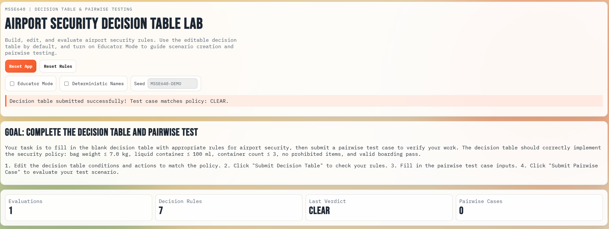
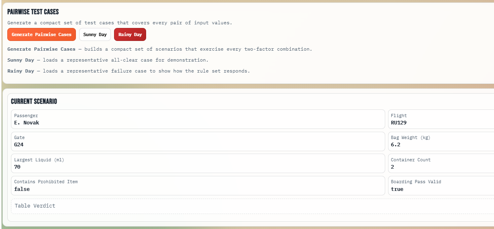
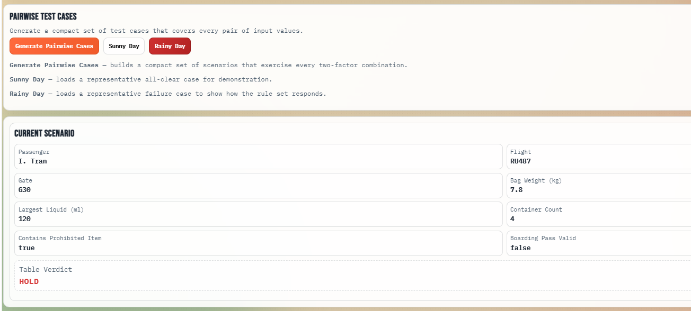
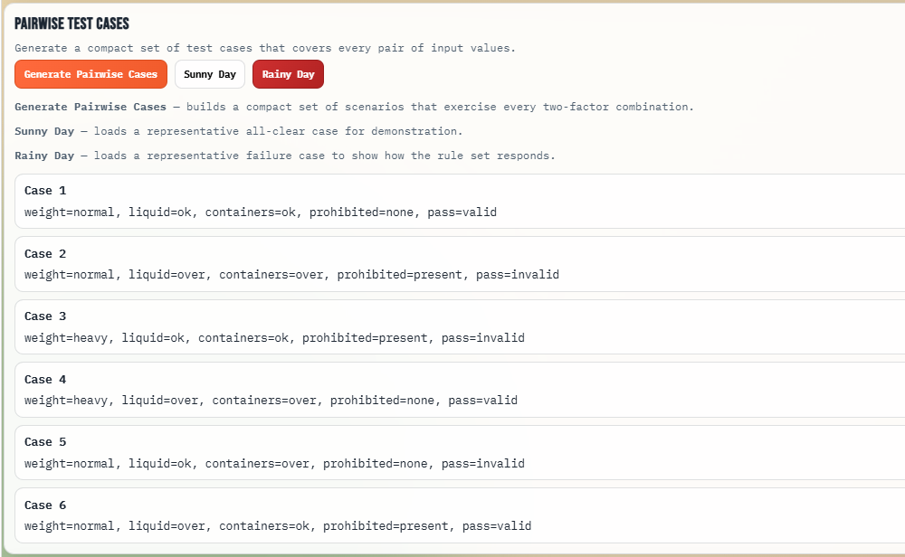
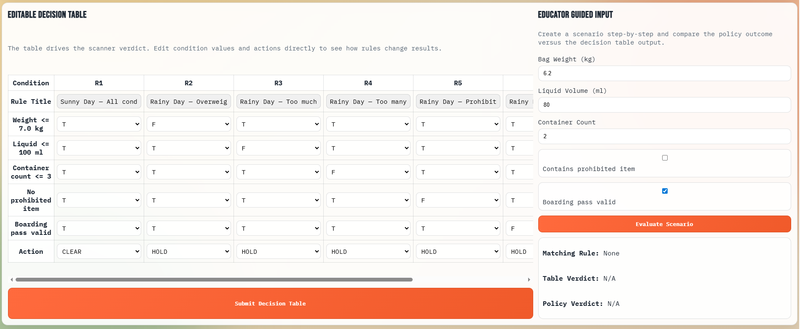
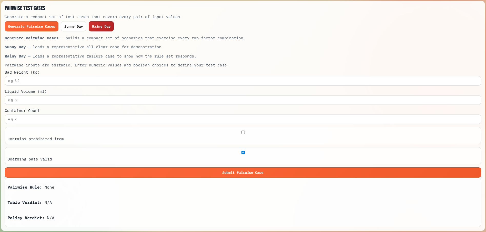

# Week5: Decision Table Testing and Pairwise Testing

## 1. Introduction: Test Case Methodologies

### Decision Table Testing

**Decision Table Testing** is a systematic black-box testing technique that captures complex business logic by mapping input conditions to expected actions in a tabular format. A decision table represents all possible combinations of conditions and their corresponding system behaviors, making it an effective tool for testing systems with multiple interdependent input parameters.

#### Structure of a Decision Table

A decision table consists of four main components:

- **Conditions (Rows):** Individual input factors or business rules that affect the system behavior
- **Actions (Rows):** The system outputs or responses that should occur
- **Rules (Columns):** Individual test cases that represent combinations of condition values
- **Condition Values:** Typically represented as True (T), False (F), or Don't Care (-)

#### When to Use Decision Table Testing

Decision Table Testing is most valuable in the following scenarios:

1. **Complex Logic:** Systems with multiple interdependent conditions that determine different outcomes
2. **Business Rules:** Applications that implement specific business policies with multiple rules
3. **Combinatorial Coverage:** When you need to test many combinations of inputs but resources are limited
4. **Boundary Conditions:** Testing systems that respond differently to conditions at or near threshold values
5. **Policy-Driven Systems:** Airport security, insurance underwriting, loan approval, access control systems

**Example Use Cases:**
- Airport security scanners (our sample app)
- Insurance claim processing
- Tax calculation systems
- Access control systems
- Regulatory compliance engines

#### Advantages

- **Comprehensive Coverage:** Ensures all relevant combinations of conditions are tested
- **Clarity:** Visual representation makes complex logic easy to understand and review
- **Completeness:** Helps identify missing test cases or contradictory rules
- **Traceability:** Easy to trace test cases back to business requirements
- **Efficiency:** Can significantly reduce the number of test cases while maintaining coverage

#### Limitations

- **Complexity Explosion:** With many conditions, the number of possible combinations grows exponentially (2^n combinations)
- **Maintenance:** Large decision tables can become unwieldy and difficult to maintain
- **Over-Specification:** May define test cases that are not practically relevant
- **Manual Effort:** Creating comprehensive decision tables requires careful analysis
- **Ordering:** The table doesn't specify the order in which conditions should be evaluated

---

### Pairwise Testing (All-Pairs Testing)

**Pairwise Testing**, also known as **All-Pairs Testing**, is an optimization technique that reduces the number of test cases required while maintaining effective coverage. Instead of testing all possible combinations of input values (which can be prohibitively large), pairwise testing ensures that every pair of input values is covered by at least one test case.

#### Mathematical Basis

For a system with n parameters, each with v_i possible values:
- **Full Combination Coverage:** Requires ∏(v_i) test cases
- **Pairwise Coverage:** Typically requires O(v_1² × v_2) to O(v_1² × v_2 × log n) test cases

**Example:**
- 5 parameters with 2 values each
- Full combination: 2^5 = 32 test cases
- Pairwise coverage: typically 10-12 test cases (a 65-75% reduction)

#### When to Use Pairwise Testing

1. **Large Parameter Spaces:** Systems with many input parameters and values
2. **Time/Resource Constraints:** When full combinatorial testing is infeasible
3. **Statistical Confidence:** When research shows 70-90% of bugs involve interactions between pairs of parameters
4. **Regression Testing:** For iterative testing cycles where speed is important

#### Advantages

- **Efficiency:** Dramatically reduces test case count while maintaining high defect detection
- **Practical Coverage:** Research shows most bugs involve 2-3 parameter interactions
- **Scalability:** Handles systems with many parameters and values
- **Automation-Friendly:** Can be generated automatically by pairwise generation tools

#### Limitations

- **Three-Way Interactions:** Does not catch bugs that require three or more parameters to interact
- **Context-Dependent:** May miss critical scenarios specific to the domain
- **Tool Dependency:** Effective generation requires specialized tools or careful manual construction
- **Not Complete:** Leaves a portion of input space untested
- **Statistical Nature:** Offers probabilistic confidence rather than exhaustive coverage

---

## 2. Sample Application: Airport Security Decision Table Lab

We created an interactive, browser-based application that demonstrates both Decision Table Testing and Pairwise Testing in the context of an airport security screening system.

### Application Overview

The **Airport Security Decision Table Lab** (`airline-security-game/`) is a web application that allows educators and students to:

1. **Build and Edit Decision Tables** — Directly manipulate the rules that drive security verdicts
2. **Compare Policy vs. Decision Table Output** — See how incorrect rule mappings create mismatches
3. **Generate Pairwise Test Cases** — Automatically create a compact set of scenarios covering all parameter pairs
4. **Evaluate Sunny Day and Rainy Day Scenarios** — Test representative pass and fail cases

**Version 2** (`index-v2.html` / `app-v2.js`) extends the original with a student-focused workflow:

- **Goal Section** — A visible banner at the top explains the task before the user begins
- **Blank Decision Table** — All condition and action cells start empty; rule titles are prefilled and read-only to control fill order
- **Submit Decision Table Button** — Users submit their completed table to check their work
- **Editable Pairwise Inputs** — Weight, liquid, containers, prohibited, and boarding pass are free-form numeric/checkbox inputs rather than preset dropdowns
- **Submit Pairwise Case Button** — Users submit a custom test case for immediate evaluation
- **Educator-Mode Pairwise Hint** — The instructional note for pairwise inputs is hidden by default and appears only when Educator Mode is enabled

#### Application Interface


### Application Architecture

#### Technology Stack
- **HTML5** — Semantic markup and form structure
- **CSS3** — Responsive layout with gradient backgrounds and modern styling
- **Vanilla JavaScript** — No dependencies; all logic implemented in pure JS

#### Key Files
- `index.html` — Original UI structure with decision table, guided input forms, and scenario display
- `app.js` — Original core logic: decision table evaluation, pairwise generation, passenger scenario creation
- `index-v2.html` — Version 2 UI: adds Goal section, prefilled rule titles, blank decision table, submit buttons, and educator-mode-gated pairwise note
- `app-v2.js` — Version 2 logic: blank default decision table, submit/validation handlers, read-only title cells
- `styles.css` — Responsive design and accessibility styling (shared by both versions)
- `README.md` — Quick reference guide (v1)
- `README-v2.md` — Quick reference guide for Version 2

### Policy Rules

The application enforces the following airport security policy:

```
IF (bag_weight > 7.0 kg) OR
   (liquid_volume > 100 ml) OR
   (container_count > 3) OR
   (prohibited_items present) OR
   (boarding_pass invalid)
THEN
   VERDICT = HOLD
ELSE
   VERDICT = CLEAR
```

### Decision Table

The application includes a 7-rule decision table. In Version 1 all cells are pre-filled; in Version 2 the condition and action cells start blank and the user must complete them.

| Rule | Title | Weight ≤ 7 | Liquid ≤ 100 | Containers ≤ 3 | No Prohibited | Pass Valid | Action |
|------|-------|-----------|-------------|----------------|--------------|----------|--------|
| R1   | Sunny Day — All conditions pass     | T | T | T | T | T | CLEAR |
| R2   | Rainy Day — Overweight              | F | T | T | T | T | HOLD  |
| R3   | Rainy Day — Too much liquid         | T | F | T | T | T | HOLD  |
| R4   | Rainy Day — Too many containers     | T | T | F | T | T | HOLD  |
| R5   | Rainy Day — Prohibited item         | T | T | T | F | T | HOLD  |
| R6   | Rainy Day — Invalid boarding pass   | T | T | T | T | F | HOLD  |
| R7   | Rainy Day — Multiple failures       | F | F | F | F | F | HOLD  |

> **Version 2 note:** Rule titles are prefilled and read-only in the UI so the fill order is controlled. All condition cells default to **T** — students flip only the conditions that should be F or - for each rule. The action column starts blank (CLEAR/HOLD). Click **Submit Decision Table** to verify the completed work.

### Sunny Day Scenario

**Scenario:** A passenger with compliant luggage and valid boarding pass

**Input Values:**
```javascript
{
  weightKg: 6.2,        // ≤ 7.0 kg ✓
  liquidsMl: 70,        // ≤ 100 ml ✓
  containerCount: 2,    // ≤ 3 ✓
  prohibited: false,    // No prohibited items ✓
  passValid: true       // Valid pass ✓
}
```

**Expected Output:**
- Decision Table Result: **CLEAR**
- Policy Result: **CLEAR**
- Match: ✓ YES

**Interpretation:** All conditions are satisfied; the passenger is cleared for boarding.

#### Application Interface - Sunny Day


### Rainy Day Scenario

**Scenario:** A passenger with multiple policy violations

**Input Values:**
```javascript
{
  weightKg: 7.8,       // > 7.0 kg ✗
  liquidsMl: 120,      // > 100 ml ✗
  containerCount: 4,   // > 3 ✗
  prohibited: true,    // Contains prohibited item ✗
  passValid: false     // Invalid pass ✗
}
```

**Expected Output:**
- Decision Table Result: **HOLD**
- Policy Result: **HOLD**
- Match: ✓ YES

**Interpretation:** Multiple policy violations; the passenger is held for inspection.

#### Application Interface - Rainy Day


### Pairwise Test Cases

The application generates a minimal set of test cases that covers all two-factor combinations of:

- Weight: {normal (≤ 7kg), heavy (> 7kg)}
- Liquid: {ok (≤ 100ml), over (> 100ml)}
- Containers: {ok (≤ 3), over (> 3)}
- Prohibited: {none, present}
- Pass: {valid, invalid}

**Example Pairwise Cases Generated (5 out of typically 10-12):**

| Case | Weight  | Liquid | Containers | Prohibited | Pass    | Verdict |
|------|---------|--------|-----------|-----------|---------|---------|
| 1    | normal  | ok     | ok        | none      | valid   | CLEAR   |
| 2    | heavy   | ok     | ok        | none      | valid   | HOLD    |
| 3    | normal  | over   | ok        | none      | valid   | HOLD    |
| 4    | normal  | ok     | over      | none      | valid   | HOLD    |
| 5    | normal  | ok     | ok        | present   | valid   | HOLD    |

The pairwise generator ensures that every pair of input values (e.g., weight=heavy with liquid=ok) appears in at least one test case.

#### Pairwise Test Case


### Educator Mode Features

When **Educator Mode** is enabled:

1. **Guided Input Panel** — Step-by-step scenario creation with immediate feedback
2. **Decision Table Comparison** — Side-by-side display of table verdict vs. policy verdict
3. **Pairwise Guided Input** — Choose specific pairwise combinations and see the result
4. **Analysis Results** — Which rule matched, and why the verdict was rendered

**Example Code: Evaluating a Guided Scenario**

```javascript
function evaluateGuidedScenario() {
  // Extract input values from guided form
  const scenario = getGuidedScenario();
  
  // Evaluate using both the decision table and the policy
  const policyVerdict = policyDecision(scenario);
  const tableResult = evaluateDecisionTable(scenario);
  
  // Display results
  dom.matchedRule.textContent = `${tableResult.ruleId} — ${tableResult.ruleTitle}`;
  dom.tableVerdictLabel.textContent = tableResult.verdict;
  dom.policyVerdictLabel.textContent = policyVerdict;
  
  // Render the passenger and verdict
  renderPassenger({ passenger: scenario, tableVerdict: tableResult.verdict });
  setBanner(`Evaluated guided scenario. Table says ${tableResult.verdict}, policy says ${policyVerdict}.`);
  refreshStats();
}
```

#### Educator View 



### Decision Table Evaluation Algorithm

**Key Code Snippet: Matching Rules**

```javascript
function evaluateDecisionTable(passenger) {
  // Compute actual condition values based on passenger data
  const actual = {
    weightOk: Number(passenger.weightKg) <= POLICY.maxWeightKg && Number(passenger.weightKg) >= 0,
    liquidOk: Number(passenger.liquidsMl) <= POLICY.maxContainerMl && Number(passenger.liquidsMl) >= 0,
    containersOk: Number(passenger.containerCount) <= POLICY.maxContainerCount && Number(passenger.containerCount) >= 0,
    noProhibited: !passenger.prohibited,
    validPass: passenger.passValid === true,
  };

  // Iterate through rules and return the first match
  for (const rule of state.decisionTable) {
    const conditions = rule.conditions;
    if (
      conditionsMatch(conditions.weightOk, actual.weightOk) &&
      conditionsMatch(conditions.liquidOk, actual.liquidOk) &&
      conditionsMatch(conditions.containersOk, actual.containersOk) &&
      conditionsMatch(conditions.noProhibited, actual.noProhibited) &&
      conditionsMatch(conditions.validPass, actual.validPass)
    ) {
      return { verdict: rule.action, ruleId: rule.id, ruleTitle: rule.title };
    }
  }

  return { verdict: "HOLD", ruleId: "Default", ruleTitle: "No matching rule; default HOLD" };
}

// Helper: Compare rule condition (T/F/-) to actual boolean
function conditionsMatch(ruleValue, actualValue) {
  if (ruleValue === "-") return true;                      // Don't care
  if (ruleValue === "T") return actualValue === true;
  if (ruleValue === "F") return actualValue === false;
  return false;
}
```

### Pairwise Generation Algorithm

**High-Level Approach:**

1. Generate all possible combinations (2^5 = 32 for our 5 binary parameters)
2. Enumerate all unique pairs: for each combination of two parameters, record every (value1, value2) pair
3. Use a greedy algorithm to select the minimal set of test cases that covers all pairs:
   - Start with an empty set of chosen cases
   - While uncovered pairs remain:
     - Select the combination that covers the most uncovered pairs
     - Add it to the chosen set
     - Mark its pairs as covered

**Result:** Typically reduces 32 combinations to 10-12 test cases.

---

## 3. Conclusion: Problems, Learnings, and AI Tool Experience

### Problems Encountered

#### 1. **Terminal File Writing Issues**
Initially, using PowerShell's `Set-Content` with multiline heredoc strings caused output retrieval failures. 

**Solution:** Used individual file creation commands and verified results by reading file contents back.

**Learning:** Terminal-based file operations for large multiline content can be fragile; using the create_file tool directly is more reliable.

#### 2. **Decision Table UI Complexity**
Building an interactive, editable decision table with dynamically created form controls required careful event binding and state management.

**Problem:** Ensuring that edits to table cells immediately reflected in the table and didn't lose state.

**Solution:** Used event delegation and full re-render on each change. While not optimal for performance, it's simple and correct for ~7 rules.

#### 3. **Pairwise Generation Algorithm**
The greedy pairwise algorithm needs careful implementation to:
- Generate all combinations
- Enumerate all pairs correctly
- Use a correct greedy heuristic (covering most uncovered pairs first)

**Challenge:** Debugging the algorithm to ensure it truly covers all parameter pairs.

**Solution:** Traced through smaller examples and verified the output manually.

#### 4. **Educator Mode Toggle Scope**
Initially, only the main guided input panel was hidden; the pairwise guided section was always visible.

**Problem:** Inconsistent educator experience; some educator-only features were missing.

**Solution:** Extended the toggle to show/hide multiple sections together.

#### 5. **Naming Conflicts**
Path references in PowerShell (`SUPERD~1` short names vs. full paths) sometimes caused inconsistent file references.

**Problem:** File edits went to different locations, or files weren't found.

**Solution:** Always verified the current file path using `Get-ChildItem` before making edits.

---

### Learnings About AI Tools

#### 1. **Context Preservation is Critical**
Using GitHub Copilot effectively requires maintaining clear context:
- Know exactly what files exist and their relative locations
- Verify file paths before making edits
- Use meaningful variable names and structured state objects

**Best Practice:** Always read a file before editing to confirm current state.

#### 2. **Agentic AI is Efficient for Scaffolding**
Using Claude (via copilot) to generate boilerplate HTML/CSS and initial JS was fast and significantly reduced manual typing. The AI correctly applied:
- CSS custom properties (variables)
- HTML semantic structure
- JavaScript module pattern with state objects

**Limitation:** AI-generated initial code sometimes has minor bugs or incomplete logic that requires refinement.

#### 3. **AI Tools Excel at Algorithm Implementation**
Writing the pairwise generation algorithm by hand would have been error-prone. Using AI to draft the algorithm saved time, though manual verification of correctness was essential.

**Pattern:** "Here's the pseudocode; write the JS" → AI generates ~85% correct implementation → Manual debugging completes it.

#### 4. **Testing is Still Manual**
UI testing, visual verification of generated test cases, and correctness validation still require human judgment. AI can't currently:
- Take screenshots or see visual output
- Verify that a pairwise set is actually covering all pairs without explicit checking
- Understand subtle business logic errors

**Best Practice:** After AI-generated feature implementation, manually test with a few examples to confirm correctness.

#### 5. **Multiline Code Generation Has Edge Cases**
Generating large HTML forms, CSS rules, and JS functions with many branches is difficult in a single prompt. Breaking them into smaller, atomic pieces is more reliable.

**Strategy:** Instead of "write the entire app.js," break it into steps:
1. Define POLICY and constants
2. Create DOM reference object
3. Implement policyDecision() function
4. Implement evaluateDecisionTable() function
5. Wire events

#### 6. **Iterative Refinement Works Better Than Perfection**
Rather than trying to build the perfect feature in one prompt, it was more effective to:
1. Build a working MVP (minimal viable product)
2. Get feedback
3. Add educator-only features
4. Hide/show sections based on mode

This mirrors agile development and aligns with how humans naturally think about features.

---

### Key Takeaways

1. **Decision Tables are powerful for complex business logic**, especially when policies have many rules and conditions. The visual representation forces clarity in requirements.

2. **Pairwise Testing is a practical optimization** when resources are limited. It catches most bugs (research suggests 70-90% of bugs involve pair-wise interactions) while reducing test cases by 60-75%.

3. **Browser-based apps are excellent for educational tools** because they require no installation, run on any device, and can provide immediate visual feedback.

4. **AI-assisted development significantly accelerates scaffolding and algorithm implementation**, but human judgment remains essential for verification, debugging, and ensuring correctness.

5. **Educational tools benefit from dual modes**: a default mode for learning and an educator mode with detailed explanations and guided input.

---

## References

1. **Decision Tables:**
   - Guru99: Decision Table Testing — https://www.guru99.com/decision-table-testing.html
   - Wikipedia: Decision table — https://en.wikipedia.org/wiki/Decision_table

2. **Pairwise Testing:**
   - NIST: Orthogonal and Near-Orthogonal Latin Squares and Cubes — https://csrc.nist.gov/projects/automated-combinatorial-testing-for-software/

3. **Testing Methodologies:**
   - Black-box testing techniques
   - All-pairs testing (combinatorial testing)
   - Boundary value analysis
   - Equivalence partitioning

---

## Appendices

### Appendix A: Running the Application Locally

**Version 1 (original):**
1. Open `airline-security-game/index.html` in a modern web browser (Chrome, Firefox, Safari, Edge).
2. Use the editable decision table to modify rules.
3. Toggle "Educator Mode" to enable guided input and pairwise scenario builder.
4. Click "Generate Pairwise Cases" to create a compact test set.
5. Evaluate "Sunny Day" and "Rainy Day" scenarios to compare policy vs. decision table verdicts.

**Version 2 (student-facing):**
1. Open `airline-security-game/index-v2.html` in a modern web browser.
2. Read the **Goal** section to understand the task.
3. Fill in the blank decision table — rule titles are prefilled; complete the condition and action columns.
4. Click **Submit Decision Table** to check your rules.
5. Enter values in the Pairwise Test Case inputs (weight, liquid, containers, prohibited item, boarding pass).
6. Click **Submit Pairwise Case** to evaluate your scenario against the policy.
7. Toggle **Educator Mode** to reveal the pairwise input hint and the guided scenario builder.

### Appendix B: Decision Table Editing Rules

- **Row Conditions:** T (True), F (False), or - (Don't Care)
- **Action Column:** CLEAR or HOLD
- **Rule Title:** Prefilled and read-only in Version 2 (controls the fill order); editable in Version 1
- **Editing:** Condition and action cells are live-editable via dropdown selects; changes take effect immediately
- **Submit:** In Version 2, click **Submit Decision Table** after completing all cells to validate your work

### Appendix C: Pairwise Parameter Mapping

| Parameter | Value 1      | Value 2    |
|-----------|------------|----------|
| Weight    | normal (6.2 kg) | heavy (7.4 kg) |
| Liquid    | ok (70 ml)  | over (120 ml) |
| Containers| ok (2)      | over (4) |
| Prohibited| none        | present  |
| Pass      | valid       | invalid  |

