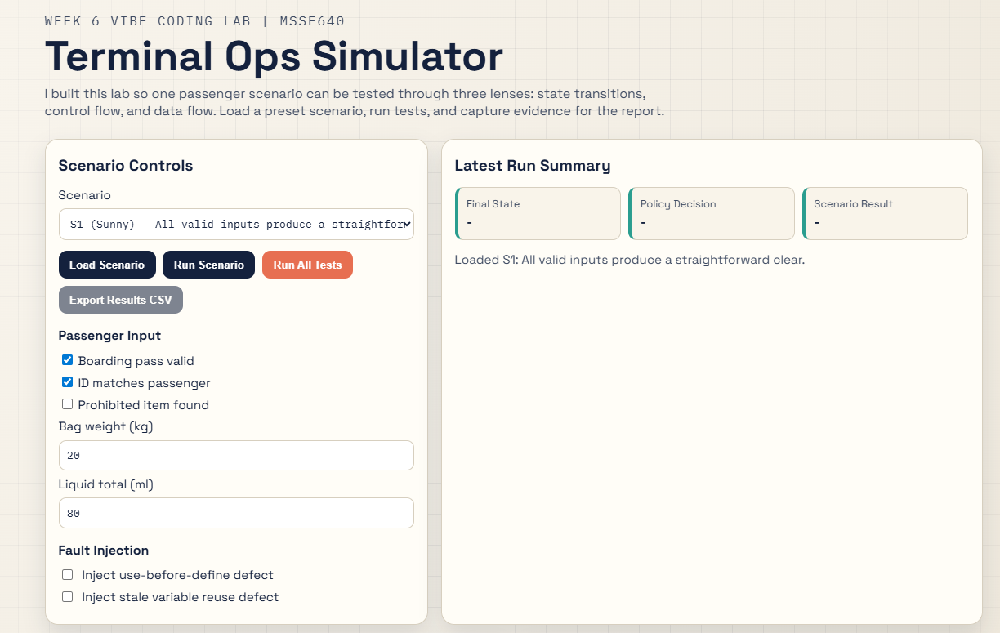
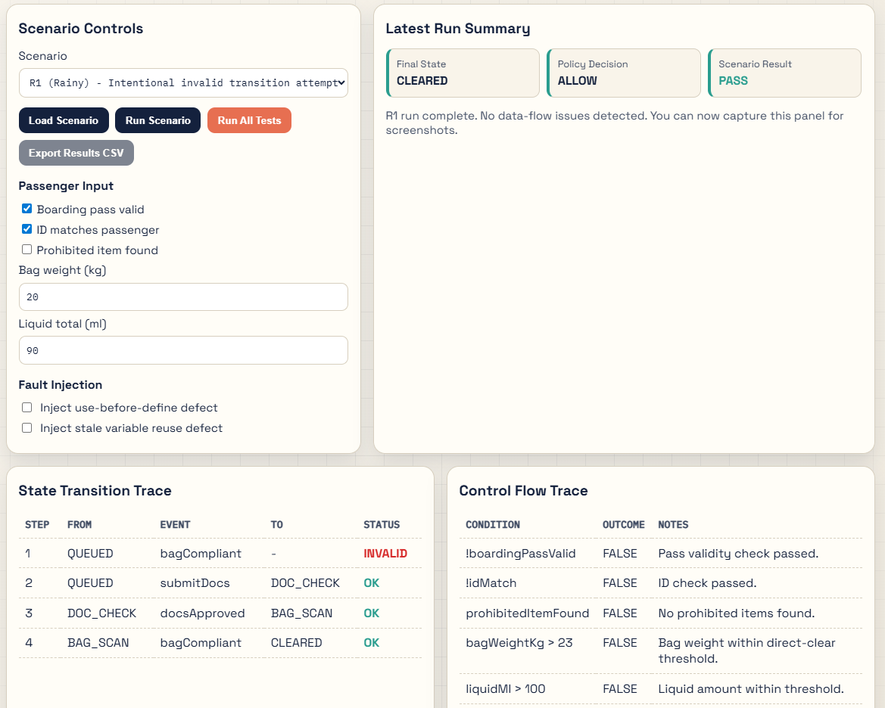
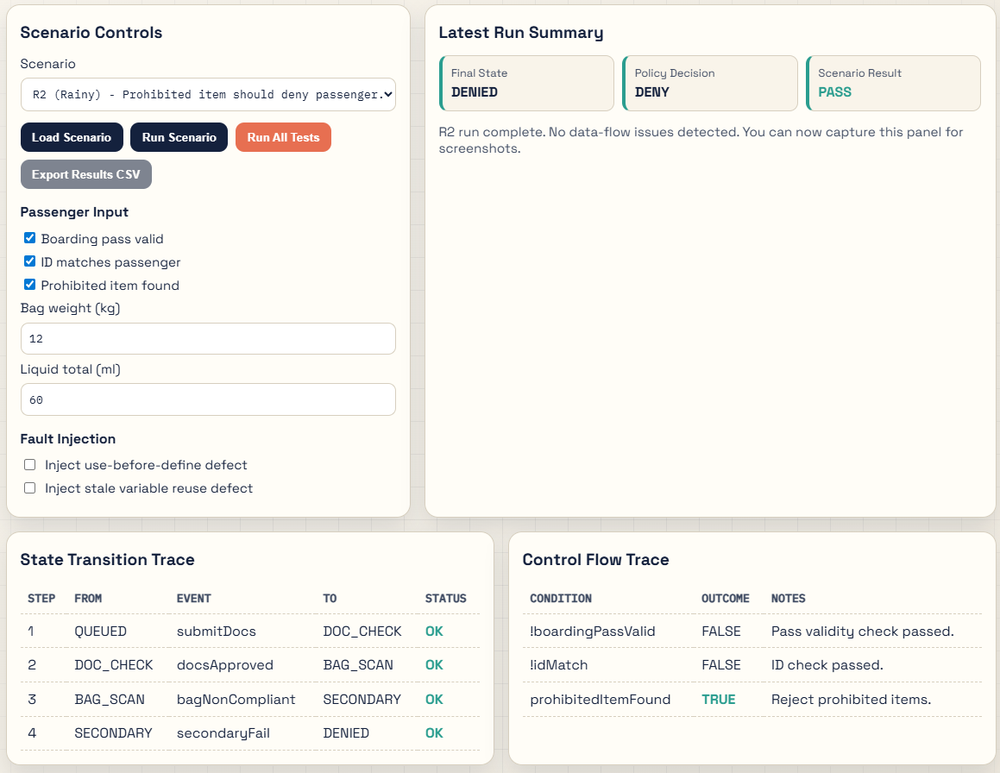
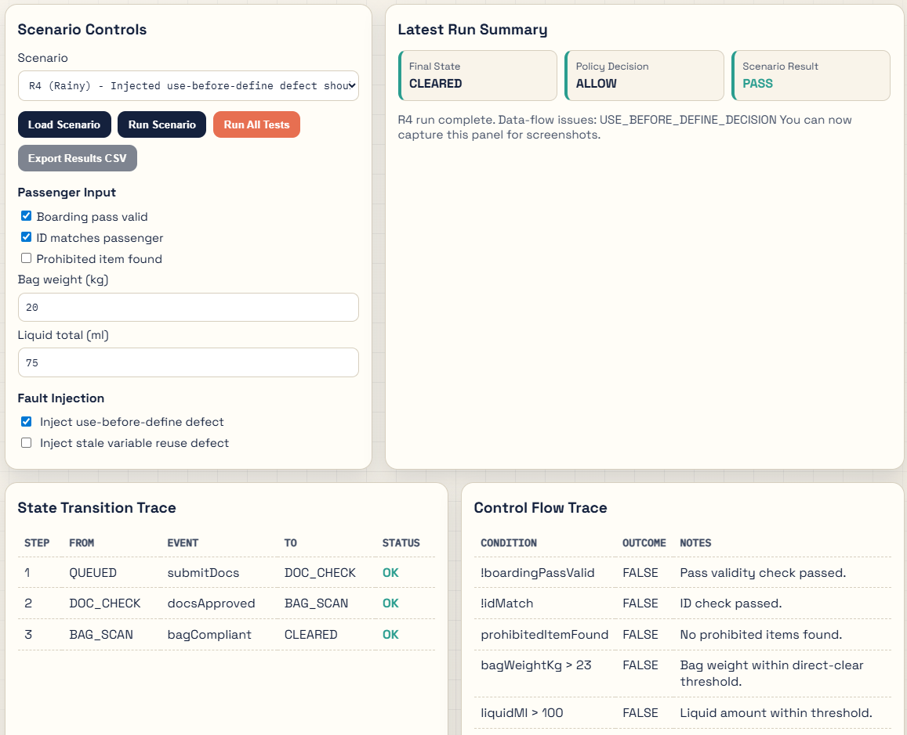
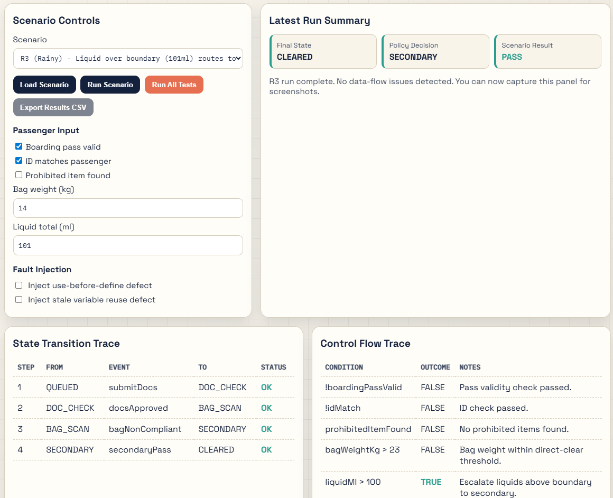
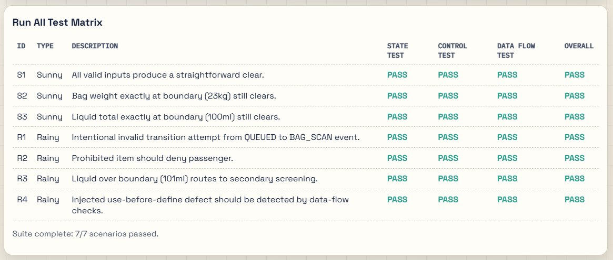
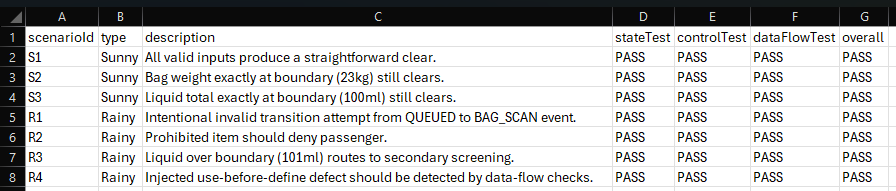

# Week 6 Vibe Coding Test Case Analysis

## Introduction
In this mini project, I demonstrate three complementary testing methodologies in one interactive application:
- State Transition Testing
- Control Flow Testing
- Data Flow Testing

I built Terminal Ops Simulator to model an airport passenger screening workflow where one scenario can be analyzed from multiple test perspectives.

### Methodology Overview
State Transition Testing validates whether the system moves correctly between states when events occur.
- Use when behavior depends on sequence and history.
- Limitations: state explosion can make complete transition coverage expensive.

Control Flow Testing validates decision paths through conditional logic.
- Use when branching correctness and path behavior are critical.
- Limitations: path explosion occurs as conditions grow.

Data Flow Testing validates how variable values are defined, used, updated, and reset.
- Use when correctness depends on variable lifecycle and dependencies.
- Limitations: instrumentation overhead and false positives can increase complexity.

## Vibe Coding Assignment
### App Summary
Terminal Ops Simulator includes one policy engine and three visible traces that I can inspect and test:
1. State transition trace (event-driven state machine)
2. Control flow trace (branch outcomes)
3. Data flow trace (variable lifecycle events)

The app supports individual scenario runs, run-all matrix testing, and CSV export of suite outcomes for documentation.

### Sunny Day and Rainy Day Scenarios
| ID | Type | Input Focus | Expected Result |
|---|---|---|---|
| S1 | Sunny | All valid data | Clear path and no data-flow defects |
| S2 | Sunny | Boundary bag weight (23kg) | Clear path at threshold |
| S3 | Sunny | Boundary liquid amount (100ml) | Clear path at threshold |
| R1 | Rainy | Invalid transition event | Invalid transition detected |
| R2 | Rainy | Prohibited item | Deny path enforced |
| R3 | Rainy | Liquid = 101ml | Secondary screening triggered |
| R4 | Rainy | Inject use-before-define | Data-flow defect flagged |

### Code Snippet 1: Transition Map
```javascript
const transitionMap = {
  QUEUED: { submitDocs: "DOC_CHECK" },
  DOC_CHECK: { docsApproved: "BAG_SCAN", docsRejected: "DENIED" },
  BAG_SCAN: { bagCompliant: "CLEARED", bagNonCompliant: "SECONDARY" },
  SECONDARY: { secondaryPass: "CLEARED", secondaryFail: "DENIED" }
};
```

### Code Snippet 2: Control Flow Policy
```javascript
if (!input.boardingPassValid) return "DENY";
if (!input.idMatch) return "DENY";
if (input.prohibitedItemFound) return "DENY";
if (input.bagWeightKg > 23) return "SECONDARY";
if (input.liquidMl > 100) return "SECONDARY";
return "ALLOW";
```

### Code Snippet 3: Data Flow Defect Detection
```javascript
function useVar(varName, note) {
  if (!defined.has(varName)) {
    issues.push({ code: `USE_BEFORE_DEFINE_${varName.toUpperCase()}`, note });
  }
  trace.push({ varName, action: "USE", note });
}
```

### Screenshots
After I capture screenshots, I place them in `Week6/images` with the filenames below so this report renders images automatically.

#### Main Simulator Interface


#### State Transition Trace (Rainy R1)


#### Control Flow Trace (Rainy R2)


#### Data Flow Defect Detection (Rainy R4)


#### Boundary Evidence (Rainy R3 - 101 ml)


#### Run-All Suite Matrix


#### CSV Export Evidence


## Conclusion
### Problems Encountered
- Designing one scenario engine that works cleanly across all three methodologies required careful mapping.
- Some edge conditions can overlap, making expected outcomes ambiguous without strict definitions.
- Data-flow tracing needs explicit variable lifecycle instrumentation.
- Export-friendly evidence formatting (tables and CSV) required extra UI logic beyond the core test engine.

### What I Learned About Agentic AI Tools
- Agentic coding tools accelerate prototyping, UI scaffolding, and scenario generation.
- Prompt specificity directly impacts output quality and testability.
- Manual validation is still essential to verify expected outcomes, especially for rainy-day defect scenarios.

### Final Reflection
Combining state transitions, control flow, and data flow in one app provides better insight than isolated examples. It helps reveal how a single defect can appear differently depending on the testing lens used.
