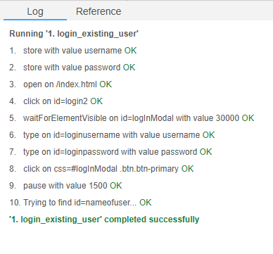
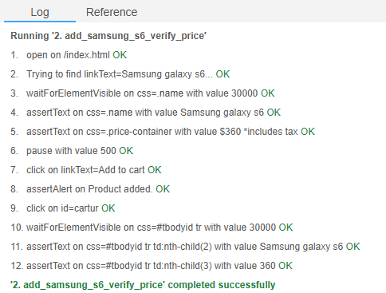
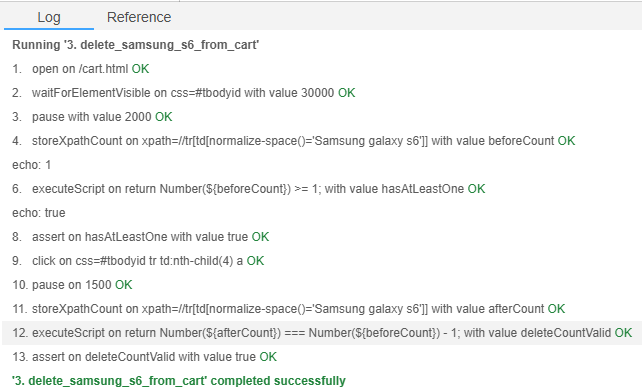
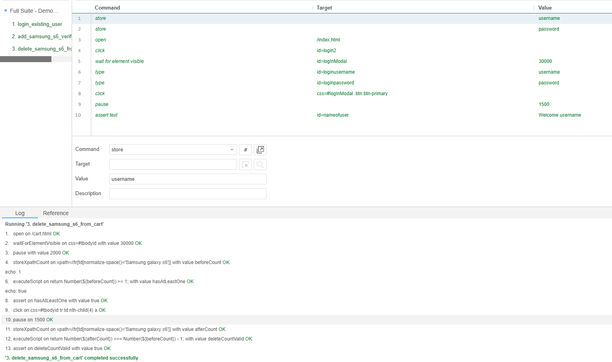
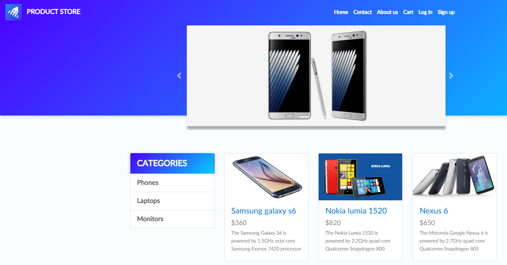

# Week 8: Selenium UI Automation Testing

## Introduction
This Week 8 lab focuses on browser-based UI automation using Selenium Desktop against a public website. I selected DemoBlaze because it is a well-known Selenium practice site with stable e-commerce flows, visible page elements, and no Kubernetes or cloud deployment requirements.

The assignment allows either the Online Boutique deployment path or an alternative public-site path. I chose the alternative path because it keeps the work centered on Selenium automation rather than environment setup. The project uses Selenium IDE/Desktop to automate three end-to-end shopping workflows and capture evidence through screenshots and a short video.

### Project Setup
- Target site: https://www.demoblaze.com/
- Automation tool: Selenium IDE/Desktop
- Browser: Chrome or Edge with Selenium IDE extension
- Test evidence: screenshots of passing runs and a short recorded walkthrough
- Test account strategy: use one pre-created DemoBlaze account for repeatable login testing
- Selenium suite artifact: `Week8/selenium-ide/demoblaze-week8.side`

## Site Selection Rationale
DemoBlaze is a good fit for this assignment for four reasons:

1. It is publicly available and commonly used for Selenium practice.
2. It supports realistic e-commerce actions such as login, product selection, cart verification, and deletion.
3. Its page structure exposes visible labels, links, buttons, and cart rows that are practical for Selenium IDE assertions.
4. It avoids the extra setup burden of deploying a containerized application such as Online Boutique.

## User Stories

### User Story 1: Returning user login
As a returning shopper, I want to log in successfully so I can manage my shopping cart.

### User Story 2: Add item and verify total
As a shopper, I want to add a product to my cart and verify its displayed price so I know the correct amount is being charged.

### User Story 3: Remove unwanted cart item
As a shopper, I want to remove an item from my cart so the cart reflects only the products I intend to buy.

## Exact Selenium Tests

The tests are implemented in the Selenium IDE project export `demoblaze-week8.side`.

### Test Case 1: Successful Login With Existing Account
**Purpose:** Verify that a saved DemoBlaze account can authenticate successfully.

**Precondition:** A DemoBlaze test account already exists.

**High-level steps:**
1. Open the DemoBlaze home page.
2. Click **Log in**.
3. Enter the saved username.
4. Enter the saved password.
5. Submit the login form.
6. Verify that the login modal closes.
7. Verify that the page shows the welcome label with the username.

**Expected result:** Login succeeds and the user appears authenticated on the home page.

**Pass criteria:** The page displays the expected welcome text for the logged-in user.

### Test Case 2: Add Samsung galaxy s6 To Cart And Verify Price
**Purpose:** Verify that the selected product appears in the cart with the correct price.

**Precondition:** The user is on the home page and the cart does not need to start empty.

**High-level steps:**
1. Open the DemoBlaze home page.
2. Click **Samsung galaxy s6**.
3. Verify the product page shows the price **$360**.
4. Click **Add to cart**.
5. Accept the confirmation alert.
6. Open the **Cart** page.
7. Verify the product name is **Samsung galaxy s6**.
8. Verify the displayed cart price is **360**.

**Expected result:** The cart contains Samsung galaxy s6 with the same displayed price as the product page.

**Pass criteria:** The product row exists in the cart and its displayed price is 360.

### Test Case 3: Remove Samsung galaxy s6 From Cart
**Purpose:** Verify that the cart updates after deleting an item.

**Precondition:** Samsung galaxy s6 is already present in the cart. This can be established by running the add-to-cart test first.

**High-level steps:**
1. Open the **Cart** page.
2. Count the number of `Samsung galaxy s6` rows before deletion.
3. Click **Delete** on one matching row.
4. Wait for the cart table to refresh.
5. Count the number of `Samsung galaxy s6` rows after deletion.
6. Verify that the count decreased by exactly 1.

**Expected result:** The selected product is removed from the cart.

**Pass criteria:** The number of cart rows containing Samsung galaxy s6 decreases by exactly one after the delete action.

## Test Data
Use one dedicated DemoBlaze account for the automated login flow.

| Field | Value |
|---|---|
| Username | `<fill before submission>` |
| Password | `<fill before submission>` |
| Product under test | Samsung galaxy s6 |
| Expected product price | 360 |

## Selenium IDE Command-Level Mapping

This section maps each assignment test to its executable Selenium IDE test name:

| Assignment test case | Selenium IDE test name | Key assertions |
|---|---|---|
| Successful login with existing account | `login_existing_user` | `Welcome <username>` appears in the account label |
| Add item and verify price | `add_samsung_s6_verify_price` | product name equals `Samsung galaxy s6`; cart price equals `360` |
| Delete item from cart | `delete_samsung_s6_from_cart` | count of rows containing `Samsung galaxy s6` decreases by 1 |

Detailed command order is documented in `Week8/selenium-ide/README.md` and encoded in the `.side` file.

## How I Ran The Tests
I ran the UI automation in Selenium IDE/Desktop using a browser extension session. Each test case was recorded, cleaned up to remove unnecessary steps, and then strengthened with explicit assertions against visible text. After the suite passed, I captured screenshots of the test runner output and the relevant site state.

### Execution Workflow
1. Open Selenium IDE.
2. Choose **Open an existing project** and import `Week8/selenium-ide/demoblaze-week8.side`.
3. Update `store` values in `login_existing_user` with the actual DemoBlaze username and password.
4. Run each test individually.
5. Run the full suite `week8_demoblaze_suite`.
6. Capture screenshots of the passing results.
7. Record a short video walkthrough of the suite execution.

## Execution Results

Fill this table immediately after executing the tests.

| Test name | Status | Notes |
|---|---|---|
| `login_existing_user` | `TBD` | |
| `add_samsung_s6_verify_price` | `TBD` | |
| `delete_samsung_s6_from_cart` | `TBD` | |
| Full suite `week8_demoblaze_suite` | `TBD` | |

## Evidence
After executing the suite, place screenshots in `Week8/images/` using the filenames below.

| Evidence | Suggested filename |
|---|---|
| Login test pass result | `login-test-pass.png` |
| Add-to-cart price verification result | `cart-price-test-pass.png` |
| Delete-from-cart result | `delete-cart-test-pass.png` |
| Full suite passing summary | `selenium-suite-pass.png` |
| Optional video still or recording reference | `video-demo-reference.png` |

Video evidence can be either a direct file recording or a share link documented in this report.

### Screenshots
Add the final screenshots after executing the suite.

#### Login Test Result

#### Add To Cart Price Test Result

#### Delete From Cart Test Result

#### Full Suite Result

#### Video Demo

## Challenges And Notes
- DemoBlaze uses alert dialogs for cart confirmation, so the Selenium IDE flow must include explicit alert handling.
- Signup is intentionally not part of the automated suite because reused usernames can make repeated runs flaky.
- The delete-from-cart test depends on the item already being present, so the suite should run in logical order or the test should include setup steps.
- If the login label does not appear quickly, rerun once after a short delay because public demo sites can respond slowly.
- Lesson learned: when `Add to cart` is executed twice for the same product, an assertion that checks for complete absence of `Samsung galaxy s6` will fail even after a valid delete action.
- Corrected validation strategy: compare the before-delete and after-delete counts for `Samsung galaxy s6` and assert the count decreases by exactly one.
- Execution note: if the cart starts empty, run the add-to-cart test first or prepare the cart manually before executing the delete test.

## Conclusion
This Week 8 assignment demonstrates practical Selenium UI automation on a public e-commerce site. By using DemoBlaze and Selenium IDE/Desktop, I can show three realistic user workflows: logging in, verifying a cart price, and removing a cart item. This approach satisfies the assignment requirements while keeping the focus on automation design, execution, and evidence collection.
