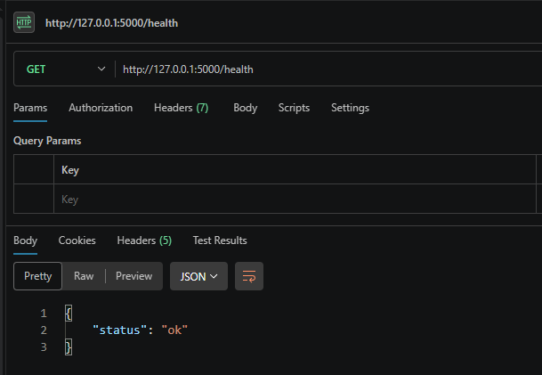
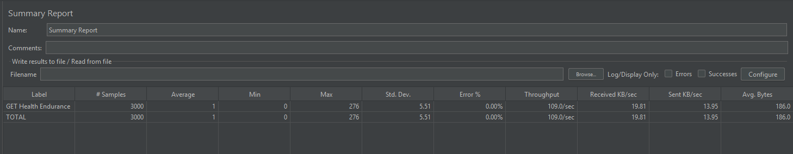

# MSSE640 — Final Presentation
## William Priddy · Worked Alone · Week 8

---

# Testing Applications

| Project | Application | Purpose |
|---|---|---|
| 1 — Unit Testing | Triangle Checker (Python) | Validate triangle logic and classify type |
| 2 — Postman | Triangle REST API (Flask) | Integration testing of CRUD endpoints |
| 3 — JMeter | Triangle REST API (Flask) | Performance and endurance testing |
| 4 — Selenium | DemoBlaze (https://www.demoblaze.com) | End-to-end UI workflow automation |

---

# How I Built It

**Project 1 — Unit Testing**
- Python `unittest` framework
- Functions: `is_valid_triangle()` and `triangle_type()`
- Test coverage: valid, invalid, boundary, and non-numeric inputs

**Project 2 — Postman**
- Postman collection with chained requests and assertions
- Request flow: health → list → create → read by id → filter → update
- Saved `triangle_id` from POST response for downstream requests

**Project 3 — JMeter**
- Thread Groups: Endurance (10 threads, 300 iterations) and Load (50 threads, 50 iterations)
- HTTP Sampler + Header Manager + Summary Report listener

**Project 4 — Selenium**
- Selenium IDE browser extension
- Recorded flows, removed flaky steps, added explicit text and count assertions

---

# AI Tools Used

**Tools:** GitHub Copilot · Claude (via Copilot)

**Where AI helped most:**
- Scaffolding HTML/CSS/JS structure quickly
- Drafting algorithmic logic (e.g., pairwise generation, ECP/BVA catalog)
- Iterating on prompt constraints to refine behavior

**Where manual work remained essential:**
- Verifying business logic against test oracles
- Checking boundary values and invalid-class behavior
- Visual and UI correctness — AI cannot see the screen

---

# Project 1 — Unit Testing Results


**8 of 8 tests passed**

| Test Case | Focus |
|---|---|
| `test_valid_triangle` | Valid side sets |
| `test_scalene_triangle` | Type classification |
| `test_scalene_triangle_all_orders` | Side order independence |
| `test_equilateral_triangle` | Type classification |
| `test_isosceles_triangle` | Type classification |
| `test_invalid_triangle` | Triangle inequality violation |
| `test_zero_length_side` | Boundary — zero side |
| `test_non_numerical_side` | Invalid input raises ValueError |

---

# Project 2 — Postman Results



**All core endpoints validated:**

| # | Request | Endpoint |
|---|---|---|
| 01 | GET | /health |
| 02 | GET | /triangles |
| 03 | POST | /triangles |
| 04 | GET | /triangles/`{{triangle_id}}` |
| 05 | GET | /triangles?type=Scalene |
| 06 | PUT | /triangles/`{{triangle_id}}` |

---

# Project 3 — JMeter Results



| Profile | Threads | Iterations | Avg Response | Throughput | Error % |
|---|---|---|---|---|---|
| Endurance | 10 | 300 | 1 ms | 109 req/sec | 0% |
| Load | 50 | 50 | 2 ms | 21.2 req/sec | 0% |

**API stable under both sustained and concurrent load.**

---

# Project 4 — Selenium Results


| Test Case | Key Assertion | Result |
|---|---|---|
| `login_existing_user` | `Welcome username` label text | ✅ Pass |
| `add_samsung_s6_verify_price` | Product name + price `360` in cart | ✅ Pass |
| `delete_samsung_s6_from_cart` | Row count decreases by exactly 1 | ✅ Pass |

---

# 🔴 DEMO — Selenium Suite Live Run

**Open:** `Week8/selenium-ide/demoblaze-week8.side`

**Run suite and narrate:**

1. **Login test** — asserts `Welcome username` appears after login
2. **Add to cart test** — asserts Samsung galaxy s6 and price `360` are in cart
3. **Delete test** — asserts matching row count decreases by exactly one

> **Backup demo if network is unstable:**
> ```
> cd group-project-writeup/Week2
> python -m unittest test_triangle_checker.py -v
> ```

---

# Agentic AI — Pros for Testing

**Speed and scaffolding**
- Drastically cut boilerplate setup time for HTML/CSS/JS game apps
- Generated scenario skeletons for ECP and BVA test catalogs quickly

**Algorithm drafting**
- AI produced ~85% correct pairwise generation logic
- Accelerated iterative refinement with explicit prompt constraints

**Scenario generation**
- Drafted sunny day and rainy day test cases as starting point
- Reduced time from concept to first working draft

---

# Agentic AI — Cons and Testing Risks

**Logic drift**
- Prompt wording produced behavior close to — but not matching — exact test-case rules
- Required multiple refinement rounds to enforce stratified bug selection requirements

**False confidence**
- AI-generated code can look correct but fail boundary expectations
- Visual and domain outcomes still require human judgment

**Coverage gaps**
- AI cannot take screenshots or verify UI rendering
- AI cannot verify pairwise coverage without explicit validation logic

---

# Special Considerations for Testing with AI

1. **Define the test oracle first** — know the expected outcome before accepting generated code
2. **Explicitly test boundaries** — AI often gets midrange correct but drifts at edge values
3. **Keep assertions deterministic** — avoid AI-generated timing assumptions that cause flakiness
4. **Treat output as a draft** — review generated tests for false positives before committing
5. **Prompt incrementally** — one atomic feature at a time is more reliable than large generations

> *"AI-assisted development significantly accelerates scaffolding and algorithm implementation,*
> *but human judgment remains essential for verification, debugging, and ensuring correctness."*
> — Week 5 writeup

---

# Key Takeaways

**Testing progression across 4 projects:**

```
Unit correctness  →  API integration  →  Performance  →  UI end-to-end
```

- Agentic AI **increased velocity** through scaffolding and first-draft generation
- **Testing rigor** — explicit assertions, boundary checks, and human review — delivered reliable quality
- The two work best **together**, not interchangeably

---

# Thank You

**William Priddy · MSSE640 · Week 8**

Questions?
